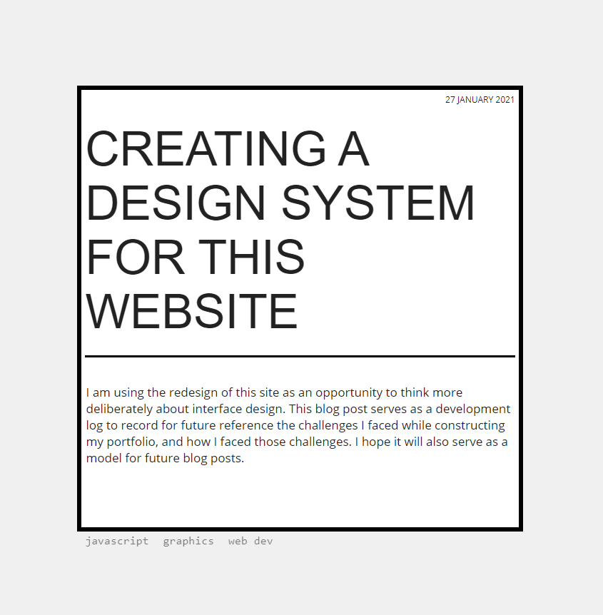
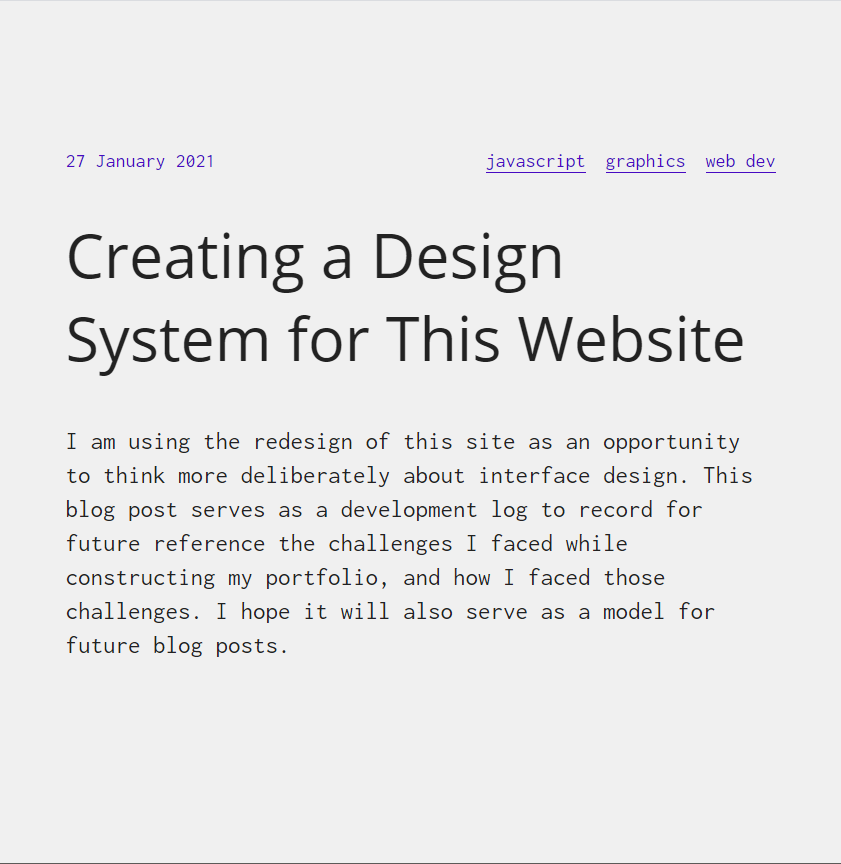
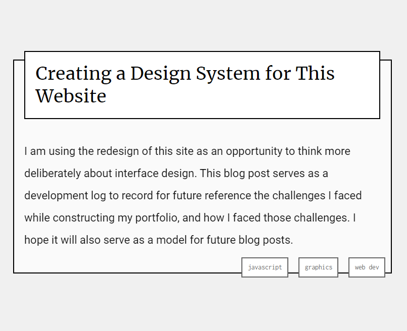
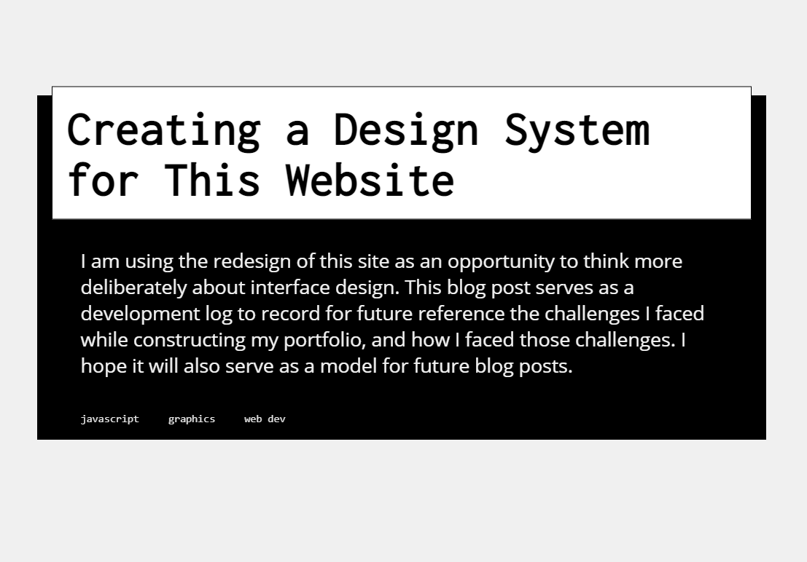
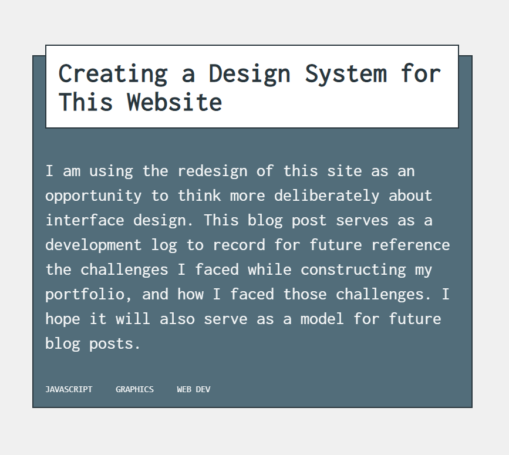
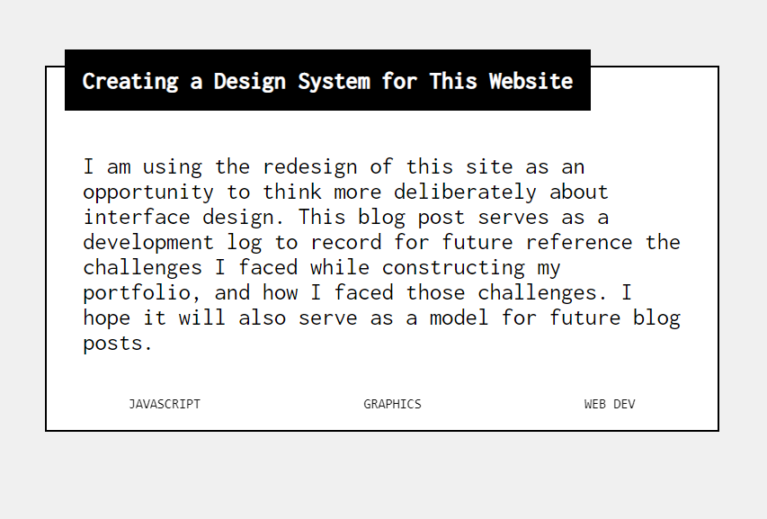

I am using the redesign of this site as an opportunity to think more deliberately about interface design. This blog post serves as a development log to record for future reference the challenges I faced while constructing my portfolio, and how I faced those challenges. I hope it will also serve as a model for future blog posts.

## Purpose of site
This site is intended to showcase my work so that I can find employement as a web developer. It will be used for:
- Documenting the development process of the projects I work on, and exploring my ideas on code and art via blogging
- Providing work samples of professional-quality projects that I have completed
- Displaying my biographical and contact information.
  
As such, I know that the site will consist of three sections: a series of blog posts, a series of work samples, and an "About Me" page.

## Development goals
The following concepts are floating around in my head as I begin this project.

### Design "information software" with an emphasis on presentation over interactivity
I am influenced in my approach by the [Magic Ink](http://worrydream.com/MagicInk/) essay by Bret Victor. Victor makes a distinction between information software, which is intended to communicate information, and manipulation software, which is intended to make things. This site can be considered 'information software' and as such should limit interactivity as much as possible. The user should not be challenged by the navigation or confused in any way by the interface. They should be able to easily navigate the site and never have their attention called away from its content. The presentation of the information is the most important aspect of the software design.

Victor devotes a large chunk of the essay to a discussion of "context-sensitive" information software. I will return to this concept below.

### What is graphic design?
For this project, I have allowed myself to embrace a limited definition of graphic design as "the use of contrast and layout to communicate the importance and vibe of information." Throughout the prototyping stage, I will continually be asking myself, "How can I use contrast -- for example, between light and dark colors, or between funky and staid fonts -- to communicate how important a given area is? How can I use contrast to communicate a relaxed vibe, or an intense one? How can layout on a grid -- the use of whitespace, the responsive changes on window resize -- aid in these goals?

### King vs. Pawn UI Design
I have also been thinking about Erik Kennedy's article [The King vs. Pawn Game of UI Design](https://learnui.design/blog/king-vs-pawn-game-ui-design.html). He proposes that when starting a site design, one should isolate a single fundamental element and design it carefully. For this reason I have started my prototyping with a basic element - the blog post card, which will link from the home page to individual blog posts. This card, with a header, small subtitle, and tags, will be fertile ground for figuring out the look and feel of the site, which I can then universalize to more peripheral elements. 

### Designing 'By The Book'
Recently I've been reading the book [Graphic Design School: The Principles and Practice of Graphic Design](https://www.wiley.com/en-us/Graphic+Design+School%3A+The+Principles+and+Practice+of+Graphic+Design%2C+7th+Edition-p-9781119647287) and I want to incorporate some of its teachings into this development process. To start, I will be using the book's recommendation that I begin by sketching a bunch of thumbnail mock-ups, letting my brain be loosey-goosey and not worry about end results, before fine-tuning a few that seem promising, until they are solid enough that I can again go loosey-goosey.

## Prototyping
After drawing 9 or 10 thumbnail sketches by hand, I mocked up 3 of them in sloppy CSS to iterate on further. Here are the 3 after a few initial rounds of iteration:

An example of iterating over an initial concept:

I chose the latter 2 to develop further. I did some more sketching by hand to come up with a full page layout that would display some navigation options and tag options alongside the main content. I planned to choose 3 layout options and develop them for each of the two prototyped blog cards.